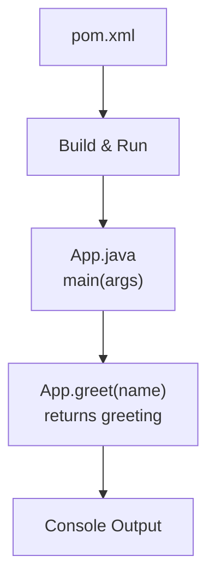
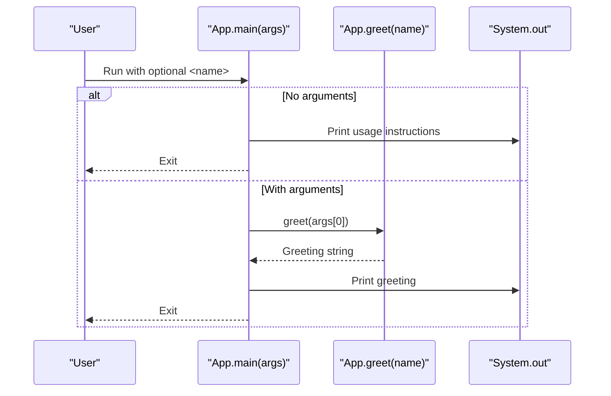
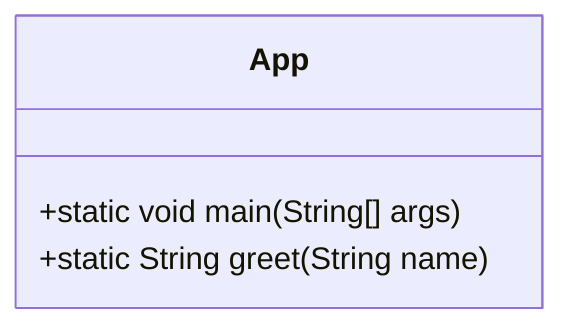
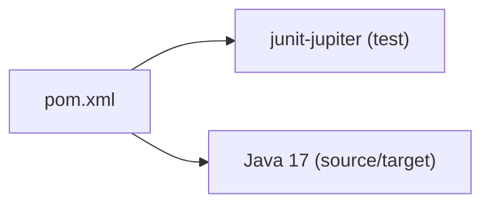

# Application Usage

<cite>
**Referenced Files in This Document**
- [App.java](file://src/main/java/com/example/App.java)
- [AppTest.java](file://src/test/java/com/example/AppTest.java)
- [pom.xml](file://pom.xml)
</cite>

## Table of Contents
1. [Introduction](#introduction)
2. [Project Structure](#project-structure)
3. [Core Components](#core-components)
4. [Architecture Overview](#architecture-overview)
5. [Detailed Component Analysis](#detailed-component-analysis)
6. [Dependency Analysis](#dependency-analysis)
7. [Performance Considerations](#performance-considerations)
8. [Troubleshooting Guide](#troubleshooting-guide)
9. [Conclusion](#conclusion)
10. [Appendices](#appendices)

## Introduction
This document explains how to use the Test AI Project’s command-line interface (CLI). The application is a small Java program that prints a personalized greeting based on a name provided via command-line arguments. It also provides usage instructions when run without arguments and demonstrates straightforward error handling for missing inputs.

The primary entry point is App.main(String[] args), which:
- Displays usage instructions if no arguments are provided
- Prints a greeting by calling the static greet() method with the first argument

The greet() method takes a name string and returns a greeting message that can be printed or used elsewhere in your workflow.

## Project Structure
The project follows a standard Maven layout:
- src/main/java/com/example/App.java contains the application logic
- src/test/java/com/example/AppTest.java contains unit tests validating the greet() behavior
- pom.xml defines the build configuration, dependencies (JUnit 5), and Java version

**Diagram sources**
- [pom.xml:1-49](file://pom.xml#L1-L49)
- [App.java:1-17](file://src/main/java/com/example/App.java#L1-L17)

**Section sources**
- [pom.xml:1-49](file://pom.xml#L1-L49)
- [App.java:1-17](file://src/main/java/com/example/App.java#L1-L17)

## Core Components
- App.main(String[] args): Entry point that handles argument presence and invokes greet().
- App.greet(String name): Static utility that formats a greeting message from the provided name.

Key behaviors:
- If no arguments are supplied, the program prints usage instructions and exits.
- If one or more arguments are supplied, it uses the first argument as the name and prints the greeting.
- The greet() method concatenates the input name into a greeting string; it does not perform validation or sanitization.

Expected outputs for common scenarios:
- No arguments: prints usage instructions including an example invocation.
- Name "World": prints a greeting addressing "World".
- Empty string: prints a greeting with no name between the comma and exclamation mark.
- Special characters: included verbatim in the greeting since there is no filtering.

Error handling and user feedback:
- Missing arguments trigger a clear usage message directing users on how to run the program correctly.
- There is no explicit exception handling; invalid or unexpected inputs will still produce output based on simple string concatenation.

Best practices for integration:
- Always pass at least one argument to avoid the usage message.
- If integrating programmatically, call App.greet(name) directly to obtain the formatted greeting string instead of parsing stdout.
- For robust workflows, validate names before calling greet() if you need constraints (e.g., non-empty, length limits, allowed characters).

**Section sources**
- [App.java:4-15](file://src/main/java/com/example/App.java#L4-L15)
- [AppTest.java:8-16](file://src/test/java/com/example/AppTest.java#L8-L16)

## Architecture Overview
At runtime, the CLI flow is:
1. JVM starts App.main with command-line arguments.
2. main checks whether any arguments were provided.
3. If none, it prints usage instructions and terminates.
4. If provided, it calls greet(args[0]) and prints the returned greeting.

**Diagram sources**
- [App.java:4-15](file://src/main/java/com/example/App.java#L4-L15)

## Detailed Component Analysis

### App.main(String[] args)
Responsibilities:
- Argument presence check
- Display usage instructions when needed
- Delegate greeting generation to greet()
- Print result to console

Behavior highlights:
- When args.length == 0, prints usage and exits immediately.
- Otherwise, prints the greeting generated by greet(args[0]).

Usage examples:
- Running without arguments shows usage instructions and an example invocation.
- Running with a name prints a greeting using that name.

Error handling:
- Provides user-friendly guidance when no arguments are given.
- Does not handle invalid types or unexpected inputs beyond what String concatenation supports.

**Section sources**
- [App.java:4-11](file://src/main/java/com/example/App.java#L4-L11)

### App.greet(String name)
Responsibilities:
- Accepts a name string
- Returns a greeting string combining a fixed prefix and the provided name

Behavior highlights:
- Simple concatenation; no trimming, validation, or escaping.
- Works with empty strings and special characters, producing corresponding output.

Validation and edge cases:
- Empty string results in a greeting with no name content.
- Special characters are preserved in the output.
- For production use, consider adding validation if you need to enforce naming rules.

**Section sources**
- [App.java:13-15](file://src/main/java/com/example/App.java#L13-L15)
- [AppTest.java:8-16](file://src/test/java/com/example/AppTest.java#L8-L16)

### Class and Method Relationships

**Diagram sources**
- [App.java:3-15](file://src/main/java/com/example/App.java#L3-L15)

## Dependency Analysis
The application has minimal external dependencies:
- JUnit Jupiter is declared as a test dependency only and is not required at runtime.
- The build targets Java 17.

**Diagram sources**
- [pom.xml:15-28](file://pom.xml#L15-L28)

**Section sources**
- [pom.xml:15-28](file://pom.xml#L15-L28)

## Performance Considerations
- The application performs constant-time operations: argument checking and string concatenation.
- Memory usage is minimal; only a few short-lived strings are created per run.
- Suitable for quick CLI tasks and scripting; not intended for high-throughput workloads.

## Troubleshooting Guide
Common issues and resolutions:
- No arguments provided:
  - Symptom: Program prints usage instructions and exits.
  - Resolution: Provide at least one argument representing the name.
- Unexpected output with special characters:
  - Symptom: Characters appear exactly as provided in the greeting.
  - Resolution: Preprocess or sanitize input before calling greet() if needed.
- Integration into scripts:
  - Recommendation: Call App.greet(name) directly in code to capture the returned string rather than parsing console output.

Validation tips:
- Ensure the name is non-empty if your workflow requires a meaningful greeting.
- Limit length and restrict character sets if necessary to prevent malformed messages.

**Section sources**
- [App.java:4-11](file://src/main/java/com/example/App.java#L4-L11)
- [AppTest.java:8-16](file://src/test/java/com/example/AppTest.java#L8-L16)

## Conclusion
The Test AI Project’s CLI is intentionally simple: provide a name to receive a personalized greeting, or run without arguments to see usage instructions. The greet() method offers a reusable way to generate greeting strings within your own applications. For robust integrations, add input validation and consider calling greet() directly rather than relying on console output.

## Appendices

### How to Build and Run
- Build the project using Maven with Java 17 as configured in the build file.
- Run the compiled application with:
  - java com.example.App World
  - java com.example.App (to see usage instructions)

Notes:
- The project compiles to a jar with the specified group and artifact identifiers.
- Tests require JUnit 5 but are not needed to run the application.

**Section sources**
- [pom.xml:1-49](file://pom.xml#L1-L49)