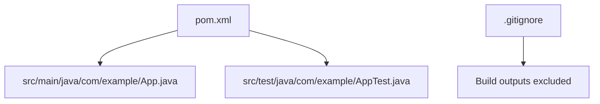
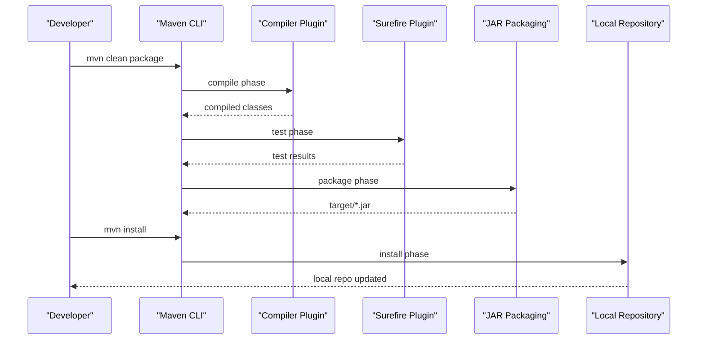
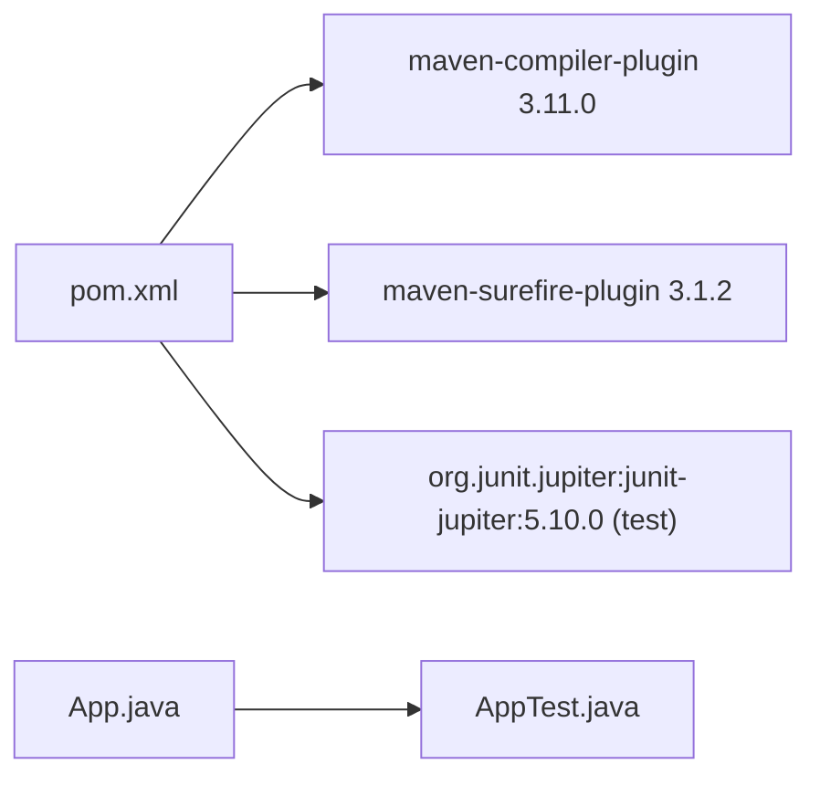

# Build and Deployment

<cite>
**Referenced Files in This Document**
- [pom.xml](file://pom.xml)
- [.gitignore](file://.gitignore)
- [App.java](file://src/main/java/com/example/App.java)
- [AppTest.java](file://src/test/java/com/example/AppTest.java)
</cite>

## Table of Contents
1. [Introduction](#introduction)
2. [Project Structure](#project-structure)
3. [Core Components](#core-components)
4. [Architecture Overview](#architecture-overview)
5. [Detailed Component Analysis](#detailed-component-analysis)
6. [Dependency Analysis](#dependency-analysis)
7. [Performance Considerations](#performance-considerations)
8. [Troubleshooting Guide](#troubleshooting-guide)
9. [Conclusion](#conclusion)
10. [Appendices](#appendices)

## Introduction
This document explains how to build, package, test, and deploy the Test AI Project using Maven. It covers Maven lifecycle phases, Java 17 compilation settings, dependency management, executable JAR creation, running the application, CI/CD integration, .gitignore behavior, and troubleshooting common issues. It also provides guidance for extending the build with code analysis and artifact publishing.

## Project Structure
The project follows standard Maven conventions:
- Source code resides under src/main/java
- Tests reside under src/test/java
- Build configuration is defined in pom.xml
- Version control exclusions are defined in .gitignore

**Diagram sources**
- [pom.xml:1-49](file://pom.xml#L1-L49)
- [App.java:1-17](file://src/main/java/com/example/App.java#L1-L17)
- [AppTest.java:1-18](file://src/test/java/com/example/AppTest.java#L1-L18)
- [.gitignore:1-23](file://.gitignore#L1-L23)

**Section sources**
- [pom.xml:1-49](file://pom.xml#L1-L49)
- [.gitignore:1-23](file://.gitignore#L1-L23)

## Core Components
- Build configuration and plugins:
  - Compiler plugin configured for Java 17 source and target
  - Surefire plugin configured for running tests
- Dependencies:
  - JUnit Jupiter (test scope) for unit testing
- Packaging:
  - JAR packaging enabled; no custom assembly or shade configuration is present
- Application entry point:
  - Main class com.example.App with a simple greeting function used by tests

Key behaviors:
- Compilation targets Java 17 via both properties and compiler plugin configuration
- Tests run during the test phase using JUnit 5
- The default JAR is produced without an executable main manifest unless explicitly configured

**Section sources**
- [pom.xml:15-47](file://pom.xml#L15-L47)
- [App.java:1-17](file://src/main/java/com/example/App.java#L1-L17)
- [AppTest.java:1-18](file://src/test/java/com/example/AppTest.java#L1-L18)

## Architecture Overview
Maven orchestrates the build lifecycle, invoking plugins at specific phases:
- compile: compiles Java sources using the configured Java 17 toolchain
- test: executes JUnit 5 tests via Surefire
- package: creates the JAR artifact in target
- install: installs the JAR into the local Maven repository

**Diagram sources**
- [pom.xml:30-47](file://pom.xml#L30-L47)

## Detailed Component Analysis

### Maven Lifecycle Phases and Configuration
- compile
  - Invokes maven-compiler-plugin to compile Java sources to bytecode targeting Java 17
  - Uses both properties and explicit plugin configuration to enforce Java 17
- test
  - Executes JUnit 5 tests via maven-surefire-plugin
  - Fails the build if any test fails
- package
  - Creates a standard JAR in target directory
  - No executable main manifest is configured by default
- install
  - Installs the generated JAR into the local Maven repository for other projects to use

Configuration highlights:
- Java version enforced via properties and compiler plugin
- Test framework: JUnit Jupiter 5.x
- Plugins: compiler and surefire with specified versions

**Section sources**
- [pom.xml:15-47](file://pom.xml#L15-L47)

### Executable JAR Creation and Running
- Default packaging produces a non-executable JAR because no main class manifest is configured
- To create an executable JAR, configure the maven-jar-plugin with a Main-Class attribute pointing to com.example.App
- After creating an executable JAR, run it with java -jar target/test-ai-project-1.0-SNAPSHOT.jar <name>

Notes:
- Without executable configuration, you can still run the app by specifying the classpath and main class manually
- For production-ready fat JARs with dependencies bundled, consider adding a shading plugin later

**Section sources**
- [pom.xml:10-10](file://pom.xml#L10-L10)
- [App.java:3-11](file://src/main/java/com/example/App.java#L3-L11)

### Dependency Management
- JUnit Jupiter is declared with test scope, so it is only available during compilation and execution of tests
- No runtime dependencies are declared; the application is self-contained except for the JDK
- Central Maven repository is used by default for resolving dependencies

Best practices:
- Pin dependency versions explicitly (already done for JUnit)
- Use dependencyManagement for shared versions in larger projects

**Section sources**
- [pom.xml:21-28](file://pom.xml#L21-L28)

### Testing Strategy
- Unit tests verify the greet method behavior
- Tests are discovered and executed automatically by Surefire during the test phase
- Assertions validate expected output strings

**Section sources**
- [AppTest.java:1-18](file://src/test/java/com/example/AppTest.java#L1-L18)
- [pom.xml:41-45](file://pom.xml#L41-L45)

### CI/CD Integration
Recommended pipeline steps:
- Install JDK 17
- Cache Maven dependencies
- Run mvn clean verify to execute compile, test, and package
- Publish artifacts (e.g., upload JARs or store as pipeline artifacts)
- Optionally add security scanning and code quality checks

Example commands:
- mvn clean verify
- mvn install

**Section sources**
- [pom.xml:15-18](file://pom.xml#L15-L18)
- [pom.xml:30-47](file://pom.xml#L30-L47)

### .gitignore Configuration
Excluded from version control:
- Build outputs: target directory and generated archives (*.jar, *.war, *.ear)
- IDE metadata: IntelliJ (.idea), Eclipse (.classpath, .project, .settings), VS Code (.vscode), and module files (*.iml, *.ipr, *.iws)
- OS-specific files: .DS_Store, Thumbs.db
- Log files: *.log

Impact:
- Keeps repositories clean and avoids committing build artifacts and environment-specific files
- Ensure your CI uses a fresh checkout and builds locally to avoid missing generated files

**Section sources**
- [.gitignore:1-23](file://.gitignore#L1-L23)

## Dependency Analysis

Observations:
- Tight coupling between pom.xml and plugins ensures consistent Java 17 compilation and test execution
- JUnit dependency is isolated to test scope, minimizing runtime footprint
- No circular dependencies exist

**Diagram sources**
- [pom.xml:21-47](file://pom.xml#L21-L47)
- [App.java:1-17](file://src/main/java/com/example/App.java#L1-L17)
- [AppTest.java:1-18](file://src/test/java/com/example/AppTest.java#L1-L18)

**Section sources**
- [pom.xml:21-47](file://pom.xml#L21-L47)

## Performance Considerations
- Use mvn -T 1C to parallelize module builds when scaling up
- Enable Maven incremental builds by avoiding unnecessary clean operations in frequent iterations
- Cache Maven repository in CI to speed up dependency resolution
- Keep dependencies minimal to reduce download and verification time

[No sources needed since this section provides general guidance]

## Troubleshooting Guide

Common build issues and resolutions:
- Java version mismatch
  - Symptom: Compilation errors about language features or invalid target
  - Resolution: Ensure JDK 17 is installed and selected; verify JAVA_HOME and PATH; confirm Maven reads Java 17
  - Reference: Java 17 is enforced via properties and compiler plugin
- Missing or incompatible dependencies
  - Symptom: ClassNotFoundException or unresolved symbols
  - Resolution: Check scopes; ensure test dependencies are not required at runtime; clear local repository cache if corrupted
- Test failures
  - Symptom: Tests fail during mvn test or mvn verify
  - Resolution: Inspect Surefire reports; fix assertions or test data; re-run with verbose logging if needed
- Executable JAR does not launch
  - Symptom: java -jar fails with “no main manifest attribute”
  - Resolution: Configure maven-jar-plugin to set Main-Class to com.example.App or run with explicit classpath and main class
- Slow builds
  - Symptom: Long dependency downloads or repeated builds
  - Resolution: Use Maven wrapper or cache; enable offline mode after initial download; consider parallel builds

Environment setup checklist:
- Install JDK 17
- Install Maven 3.8+
- Verify versions: java -version, mvn -version
- Confirm network access to Maven Central or configured mirrors

**Section sources**
- [pom.xml:15-18](file://pom.xml#L15-L18)
- [pom.xml:32-45](file://pom.xml#L32-L45)
- [App.java:3-11](file://src/main/java/com/example/App.java#L3-L11)

## Conclusion
The Test AI Project uses a straightforward Maven setup targeting Java 17 with JUnit 5 for testing. By default, it produces a standard JAR; configure the JAR plugin to create an executable artifact if desired. The provided .gitignore keeps the repository clean by excluding build outputs and IDE files. With these foundations, you can integrate the project into CI/CD pipelines and extend the build with additional tasks such as static analysis and artifact publishing.

[No sources needed since this section summarizes without analyzing specific files]

## Appendices

### Extending the Build Process
Add static analysis and reporting:
- Integrate PMD, Checkstyle, or SpotBugs via their Maven plugins in the build section
- Generate reports and fail the build on violations

Publishing artifacts:
- Configure maven-deploy-plugin or use CI/CD to publish to a private repository
- Set up credentials securely in CI secrets

Reproducible builds:
- Use a Maven Wrapper to lock Maven version
- Pin all plugin and dependency versions
- Consider enabling deterministic builds where supported

[No sources needed since this section provides general guidance]