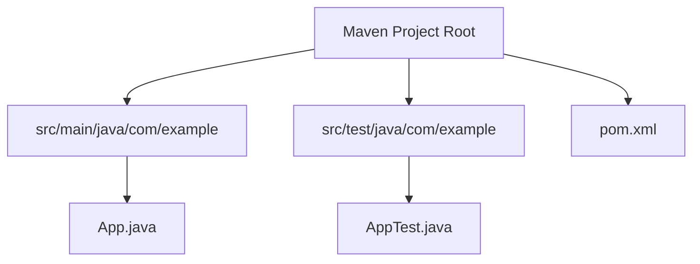
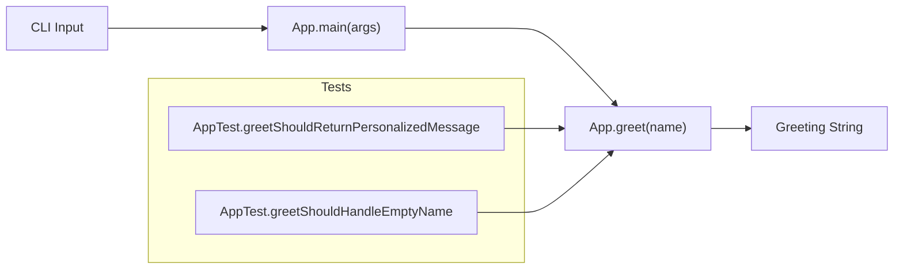
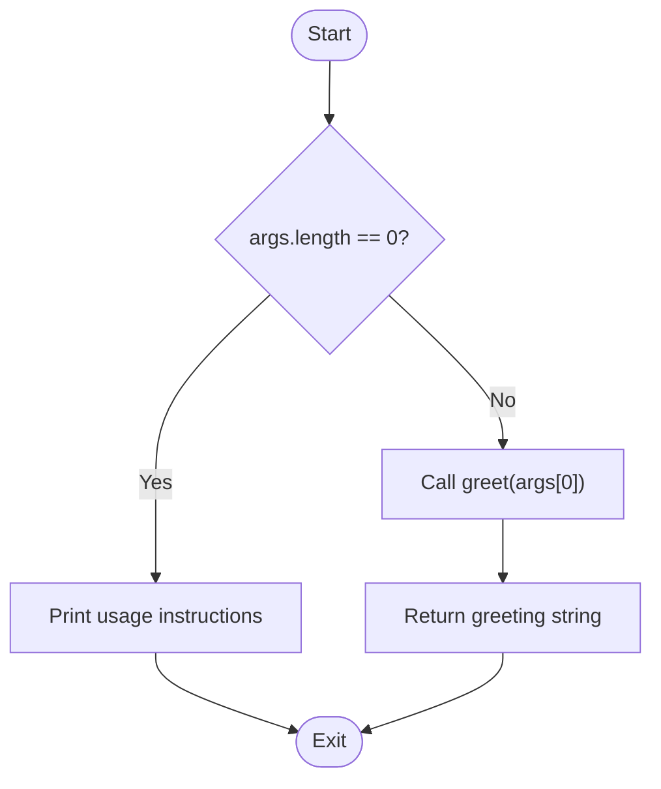
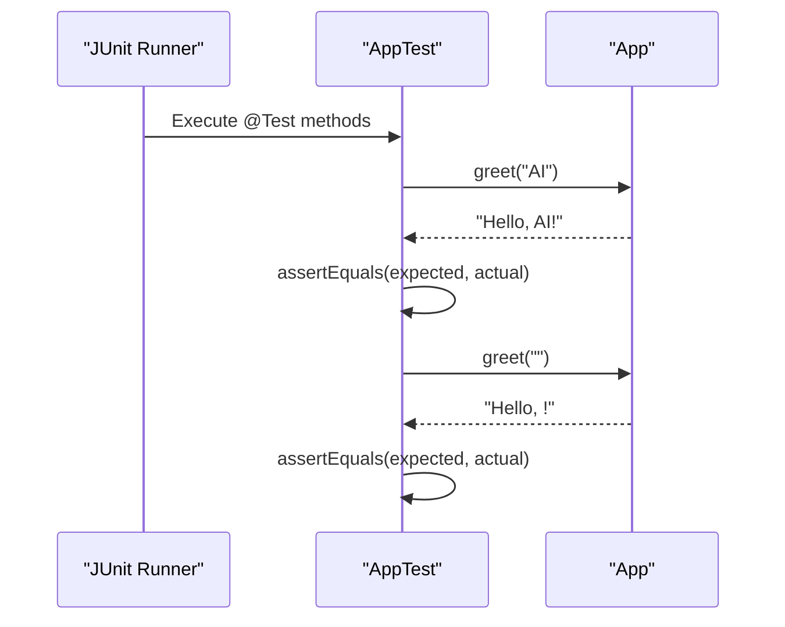
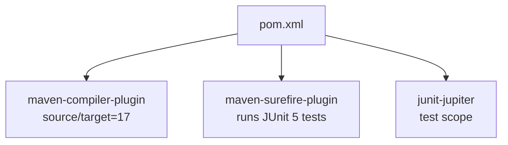

# Code Structure

<cite>
**Referenced Files in This Document**
- [pom.xml](file://pom.xml)
- [App.java](file://src/main/java/com/example/App.java)
- [AppTest.java](file://src/test/java/com/example/AppTest.java)
</cite>

## Table of Contents
1. [Introduction](#introduction)
2. [Project Structure](#project-structure)
3. [Core Components](#core-components)
4. [Architecture Overview](#architecture-overview)
5. [Detailed Component Analysis](#detailed-component-analysis)
6. [Dependency Analysis](#dependency-analysis)
7. [Performance Considerations](#performance-considerations)
8. [Troubleshooting Guide](#troubleshooting-guide)
9. [Conclusion](#conclusion)

## Introduction
This document explains the code structure and architecture of the Test AI Project, a minimal Maven-based Java application. It covers the standard Maven layout, the single entry point class with CLI handling and message generation, JUnit 5 unit tests, and the Maven configuration for compilation and testing. The project follows a simple static-method design to keep the code approachable while demonstrating test-driven development (TDD) practices.

## Project Structure
The project uses the conventional Maven directory layout:
- src/main/java: Application source code under com.example package
- src/test/java: Unit tests under the same package for direct access to production classes
- pom.xml: Build configuration including Java version, dependencies, and plugins

**Diagram sources**
- [pom.xml:1-49](file://pom.xml#L1-L49)
- [App.java:1-17](file://src/main/java/com/example/App.java#L1-L17)
- [AppTest.java:1-18](file://src/test/java/com/example/AppTest.java#L1-L18)

**Section sources**
- [pom.xml:1-49](file://pom.xml#L1-L49)

## Core Components
- App.java: Single entry point providing:
  - main(String[] args): CLI handler that prints usage when no arguments are provided and otherwise generates a greeting via greet()
  - greet(String name): Static method that returns a personalized greeting string
- AppTest.java: JUnit 5 unit tests validating:
  - Correct greeting output for a given name
  - Behavior when an empty name is provided
- pom.xml: Build configuration specifying:
  - Java 17 compiler settings
  - JUnit Jupiter dependency for testing
  - Maven Compiler Plugin and Surefire Plugin for building and running tests

Key responsibilities:
- App.java encapsulates business logic as pure functions (static methods), making it easy to test and reuse
- AppTest.java ensures correctness through assertions on expected outputs
- pom.xml centralizes build and test execution behavior

**Section sources**
- [App.java:1-17](file://src/main/java/com/example/App.java#L1-L17)
- [AppTest.java:1-18](file://src/test/java/com/example/AppTest.java#L1-L18)
- [pom.xml:1-49](file://pom.xml#L1-L49)

## Architecture Overview
The application follows a straightforward, flat architecture:
- Entry point: App.main handles command-line input and delegates to App.greet
- Business logic: App.greet produces a greeting string based on input
- Tests: AppTest validates App.greet behavior using JUnit 5

**Diagram sources**
- [App.java:4-15](file://src/main/java/com/example/App.java#L4-L15)
- [AppTest.java:8-16](file://src/test/java/com/example/AppTest.java#L8-L16)

## Detailed Component Analysis

### App.java: Entry Point and Message Generation
- Responsibilities:
  - Parse CLI arguments and print usage if none are provided
  - Generate a greeting by calling greet()
  - Provide a pure function greet() for deterministic output
- Design notes:
  - Uses static methods for simplicity and ease of testing
  - No external state or side effects beyond printing to stdout

**Diagram sources**
- [App.java:4-15](file://src/main/java/com/example/App.java#L4-L15)

**Section sources**
- [App.java:1-17](file://src/main/java/com/example/App.java#L1-L17)

### AppTest.java: JUnit 5 Unit Tests
- Framework: JUnit Jupiter (JUnit 5)
- Test cases:
  - Validates correct greeting for a non-empty name
  - Validates behavior when name is empty
- Assertions:
  - Uses assertEquals to compare expected vs actual results from App.greet

**Diagram sources**
- [AppTest.java:8-16](file://src/test/java/com/example/AppTest.java#L8-L16)
- [App.java:13-15](file://src/main/java/com/example/App.java#L13-L15)

**Section sources**
- [AppTest.java:1-18](file://src/test/java/com/example/AppTest.java#L1-L18)

### pom.xml: Build Configuration
- Java version:
  - Source and target set to 17 via properties and compiler plugin configuration
- Dependencies:
  - JUnit Jupiter 5.10.0 added with test scope for unit testing
- Plugins:
  - maven-compiler-plugin configured to compile against Java 17
  - maven-surefire-plugin configured to run JUnit 5 tests during the test phase

**Diagram sources**
- [pom.xml:15-46](file://pom.xml#L15-L46)

**Section sources**
- [pom.xml:1-49](file://pom.xml#L1-L49)

## Dependency Analysis
- Internal dependencies:
  - AppTest depends on App.greet to validate behavior
- External dependencies:
  - JUnit Jupiter provides testing framework APIs used in AppTest
- Build-time vs runtime:
  - JUnit is scoped to test; not required at runtime for the application
- Coupling:
  - Minimal coupling due to small surface area; App exposes a single static method for testing

**Diagram sources**
- [App.java:13-15](file://src/main/java/com/example/App.java#L13-L15)
- [AppTest.java:3-16](file://src/test/java/com/example/AppTest.java#L3-L16)
- [pom.xml:21-28](file://pom.xml#L21-L28)

**Section sources**
- [pom.xml:21-28](file://pom.xml#L21-L28)
- [AppTest.java:1-18](file://src/test/java/com/example/AppTest.java#L1-L18)
- [App.java:1-17](file://src/main/java/com/example/App.java#L1-L17)

## Performance Considerations
- The application performs constant-time string concatenation in greet(), which is negligible for typical inputs.
- No I/O bottlenecks beyond console output in main().
- For larger applications, consider:
  - Avoiding excessive string concatenation in tight loops
  - Using buffered I/O for large outputs
  - Profiling to identify hotspots before optimizing

[No sources needed since this section provides general guidance]

## Troubleshooting Guide
- Running the application without arguments:
  - Expected behavior: Prints usage instructions and exits
  - Verify that main() checks args length and prints usage accordingly
- Test failures:
  - Ensure JUnit Jupiter is available in the test classpath (configured in pom.xml)
  - Confirm that App.greet returns the expected greeting format for given inputs
- Build issues:
  - If compilation fails, verify Java 17 toolchain is installed and configured
  - Ensure Maven plugins versions are compatible with your environment

**Section sources**
- [App.java:4-11](file://src/main/java/com/example/App.java#L4-L11)
- [pom.xml:15-46](file://pom.xml#L15-L46)

## Conclusion
The Test AI Project demonstrates a clean, minimal Maven setup with a clear separation between application code and tests. App.java provides a simple CLI and a pure greeting function, while AppTest.java validates behavior using JUnit 5. The pom.xml configures Java 17 compilation and test execution. This structure supports test-driven development by enabling quick iteration and reliable verification of functionality.