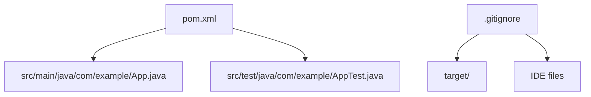

# Getting Started

<cite>
**Referenced Files in This Document**
- [pom.xml](file://pom.xml)
- [App.java](file://src/main/java/com/example/App.java)
- [AppTest.java](file://src/test/java/com/example/AppTest.java)
- [.gitignore](file://.gitignore)
</cite>

## Table of Contents
1. [Introduction](#introduction)
2. [Prerequisites](#prerequisites)
3. [Project Structure](#project-structure)
4. [Installation and Setup](#installation-and-setup)
5. [Building the Project](#building-the-project)
6. [Running the Application](#running-the-application)
7. [Running Tests](#running-tests)
8. [Basic Usage Examples](#basic-usage-examples)
9. [Troubleshooting Guide](#troubleshooting-guide)
10. [Conclusion](#conclusion)

## Introduction
This guide helps you set up, build, run, and test the Test AI Project. The project is a small Java application built with Maven that demonstrates basic command-line usage and unit testing. You will learn how to prepare your environment, compile the code, execute the application with arguments, and run tests using Maven.

## Prerequisites
Before you begin, ensure your development environment meets the following requirements:

- Java Development Kit (JDK) 17 or later installed and available on your system PATH
- Apache Maven 3.6+ installed and available on your system PATH
- A terminal or command prompt with access to mvn and java commands

Verification steps:
- Confirm Java version by running a command similar to: java -version
- Confirm Maven version by running a command similar to: mvn -version

Notes:
- The project is configured for Java 17 compilation and execution as defined in the build configuration.
- Ensure your JAVA_HOME and PATH are set so that the correct JDK is used by Maven.

**Section sources**
- [pom.xml:15-19](file://pom.xml#L15-L19)
- [pom.xml:30-47](file://pom.xml#L30-L47)

## Project Structure
The project follows standard Maven conventions:

- src/main/java: Contains the main application source code
- src/test/java: Contains unit tests
- pom.xml: Defines project metadata, dependencies, and build plugins
- .gitignore: Excludes generated and IDE-specific files from version control

Key files:
- App.java: Entry point with command-line argument handling and greeting logic
- AppTest.java: Unit tests validating the greeting behavior
- pom.xml: Configures Java 17, JUnit 5 for testing, and Maven plugins for compilation and test execution

**Diagram sources**
- [pom.xml:1-49](file://pom.xml#L1-L49)
- [App.java:1-17](file://src/main/java/com/example/App.java#L1-L17)
- [AppTest.java:1-18](file://src/test/java/com/example/AppTest.java#L1-L18)
- [.gitignore:1-23](file://.gitignore#L1-L23)

**Section sources**
- [pom.xml:1-49](file://pom.xml#L1-L49)
- [App.java:1-17](file://src/main/java/com/example/App.java#L1-L17)
- [AppTest.java:1-18](file://src/test/java/com/example/AppTest.java#L1-L18)
- [.gitignore:1-23](file://.gitignore#L1-L23)

## Installation and Setup
Follow these steps to get the project ready for development:

1. Clone the repository into a local directory
2. Open a terminal and navigate to the project root (where pom.xml resides)
3. Verify that Java 17 and Maven are accessible via your PATH
4. Optionally configure your IDE to use the same JDK version as the project

Tips:
- If you encounter “java not found” or “mvn not found,” update your system PATH to include the JDK and Maven bin directories.
- On Windows, ensure your command prompt or PowerShell uses the correct JDK installation.

**Section sources**
- [pom.xml:15-19](file://pom.xml#L15-L19)

## Building the Project
Build the project using Maven to compile sources and package the application:

- Run: mvn clean install

What this does:
- Cleans previous build artifacts
- Compiles Java sources against Java 17
- Runs tests during the default lifecycle
- Packages the application into a JAR under target/

Expected outputs:
- Compiled classes under target/classes
- Test results under target/surefire-reports
- JAR file under target/

**Section sources**
- [pom.xml:30-47](file://pom.xml#L30-L47)

## Running the Application
After building, run the application directly using the compiled class or the packaged JAR.

Using the compiled class:
- Command example: java com.example.App World

Using the packaged JAR:
- Command example: java -jar target/test-ai-project-1.0-SNAPSHOT.jar World

Behavior:
- If no arguments are provided, the application prints usage instructions
- If an argument is provided, it prints a personalized greeting

Note:
- Ensure you are in the project root when executing commands so paths resolve correctly.

**Section sources**
- [App.java:4-15](file://src/main/java/com/example/App.java#L4-L15)

## Running Tests
Execute unit tests using Maven:

- Command: mvn test

Details:
- Uses JUnit Jupiter (JUnit 5) as configured in the project
- Reports are generated under target/surefire-reports
- Failures will cause the build to fail unless explicitly skipped

To run tests only without packaging:
- Command: mvn test

To skip tests during build:
- Command: mvn install -DskipTests

**Section sources**
- [pom.xml:21-28](file://pom.xml#L21-L28)
- [pom.xml:41-45](file://pom.xml#L41-L45)
- [AppTest.java:6-17](file://src/test/java/com/example/AppTest.java#L6-L17)

## Basic Usage Examples
Here are common ways to interact with the application:

- Show usage message:
  - java com.example.App
- Print a greeting:
  - java com.example.App World
  - java com.example.App AI
- Run via packaged JAR:
  - java -jar target/test-ai-project-1.0-SNAPSHOT.jar World

What to expect:
- Without arguments: usage instructions are printed
- With arguments: a greeting string is printed to standard output

**Section sources**
- [App.java:4-15](file://src/main/java/com/example/App.java#L4-L15)

## Troubleshooting Guide
Common setup issues and resolutions:

- “java not found” or wrong Java version:
  - Ensure JDK 17 is installed and JAVA_HOME points to it
  - Confirm java -version reports 17.x
  - Update PATH to prioritize the correct JDK bin directory

- “mvn not found”:
  - Install Maven and add its bin directory to PATH
  - Verify with mvn -version

- Build fails due to Java version mismatch:
  - Align your JDK with the project’s configured source/target (Java 17)
  - Reinstall or reconfigure your JDK if necessary

- Tests fail unexpectedly:
  - Run mvn clean test to rebuild and rerun tests
  - Inspect surefire reports under target/surefire-reports for details

- Permission or path issues when running the JAR:
  - Ensure you are in the project root
  - Check that the JAR exists at target/test-ai-project-1.0-SNAPSHOT.jar after a successful build

- IDE integration problems:
  - Import the project as a Maven project
  - Set the project SDK to Java 17
  - Refresh Maven dependencies in your IDE

**Section sources**
- [pom.xml:15-19](file://pom.xml#L15-L19)
- [pom.xml:30-47](file://pom.xml#L30-L47)
- [.gitignore:1-23](file://.gitignore#L1-L23)

## Conclusion
You now have everything needed to set up, build, run, and test the Test AI Project. Use the provided commands to compile the application, execute it with arguments, and validate functionality through unit tests. Refer back to this guide whenever you need to refresh your workflow or troubleshoot environment issues.