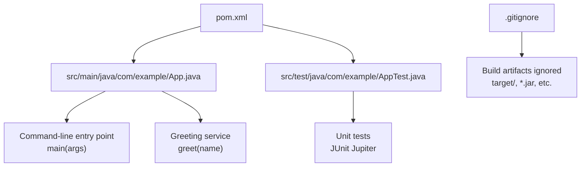
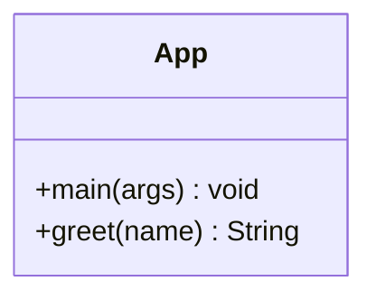
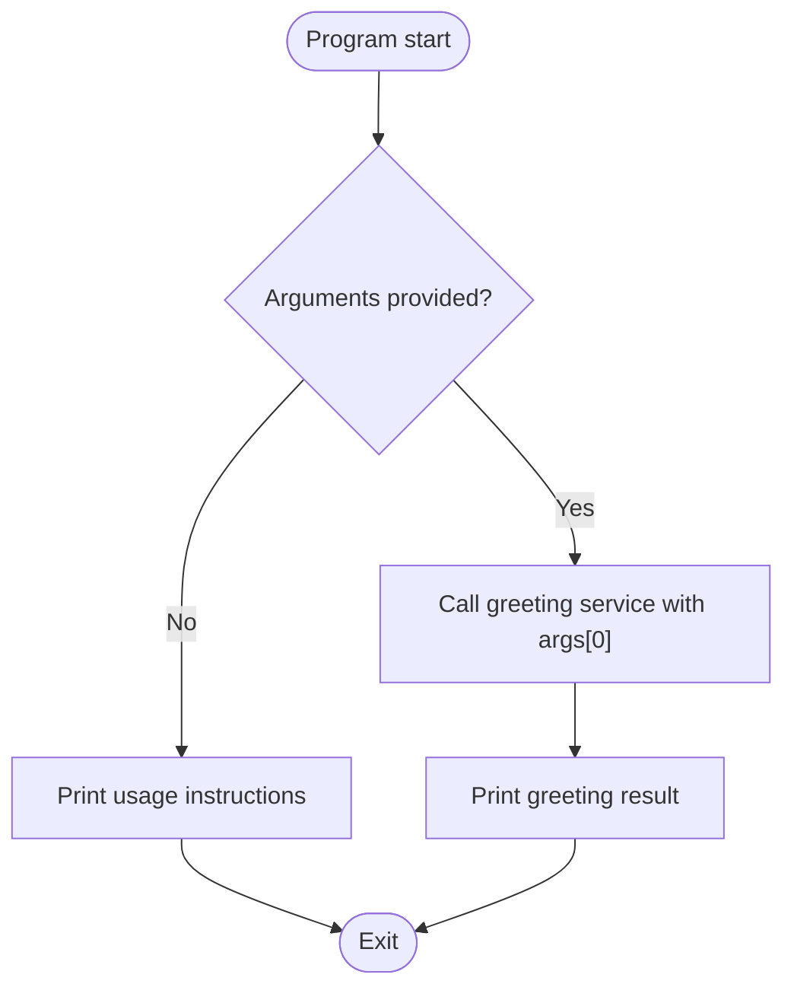
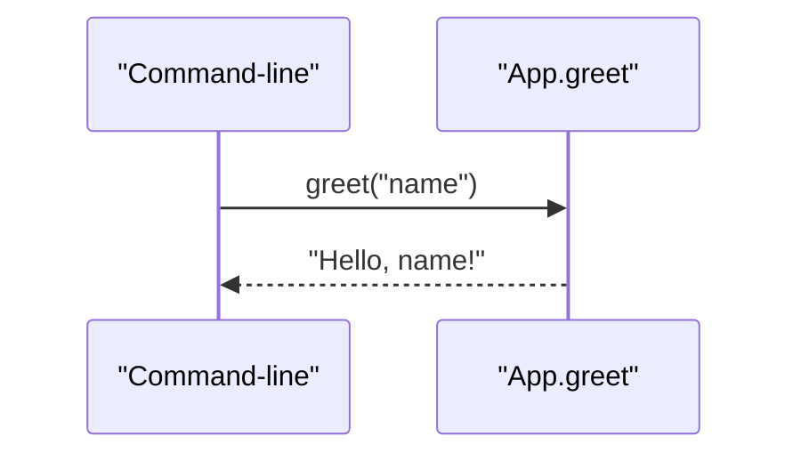
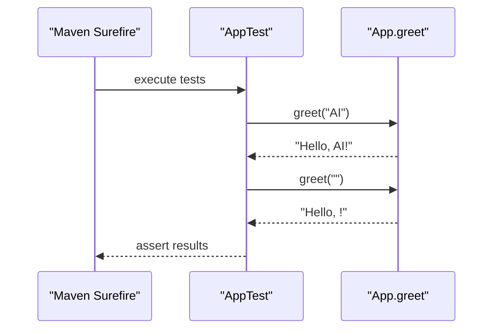
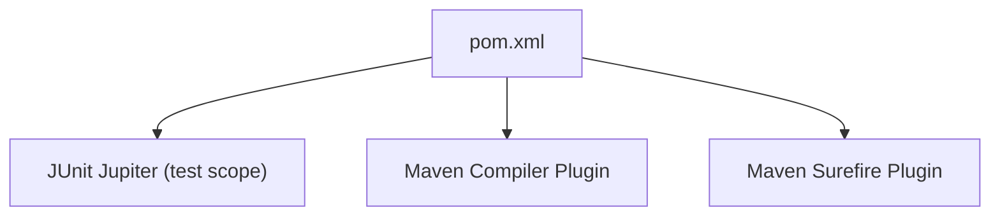

# Project Overview

<cite>
**Referenced Files in This Document**
- [pom.xml](file://pom.xml)
- [App.java](file://src/main/java/com/example/App.java)
- [AppTest.java](file://src/test/java/com/example/AppTest.java)
- [.gitignore](file://.gitignore)
</cite>

## Table of Contents
1. [Introduction](#introduction)
2. [Project Structure](#project-structure)
3. [Core Components](#core-components)
4. [Architecture Overview](#architecture-overview)
5. [Detailed Component Analysis](#detailed-component-analysis)
6. [Dependency Analysis](#dependency-analysis)
7. [Performance Considerations](#performance-considerations)
8. [Troubleshooting Guide](#troubleshooting-guide)
9. [Conclusion](#conclusion)
10. [Appendices](#appendices)

## Introduction
The Test AI Project is a minimal Java application designed to demonstrate basic project structure and workflows for AI coding assistance testing. It provides a simple command-line interface that prints a greeting message based on an input name. The project targets developers learning Java and Maven, offering a small, focused codebase to explore building, running, and testing Java applications with standard tooling.

Key characteristics:
- Single-class application with static methods
- Command-line interface for user interaction
- Unit testing setup using JUnit Jupiter via Maven
- Demonstrates typical Maven project layout and build configuration

This project serves as a starting point for understanding how a Java application is organized, compiled, executed, and tested, while also illustrating how AI-assisted development can be validated through automated tests and reproducible builds.

## Project Structure
The project follows the conventional Maven directory layout:
- Source code under src/main/java
- Tests under src/test/java
- Build configuration in pom.xml
- Version control ignores in .gitignore

**Diagram sources**
- [pom.xml:1-49](file://pom.xml#L1-L49)
- [App.java:1-17](file://src/main/java/com/example/App.java#L1-L17)
- [AppTest.java:1-18](file://src/test/java/com/example/AppTest.java#L1-L18)
- [.gitignore:1-23](file://.gitignore#L1-L23)

**Section sources**
- [pom.xml:1-49](file://pom.xml#L1-L49)
- [App.java:1-17](file://src/main/java/com/example/App.java#L1-L17)
- [AppTest.java:1-18](file://src/test/java/com/example/AppTest.java#L1-L18)
- [.gitignore:1-23](file://.gitignore#L1-L23)

## Core Components
- Application class (command-line interface): Provides the main entry point and handles argument parsing to display usage instructions or invoke the greeting service.
- Greeting service: A static method that formats a personalized greeting string from the provided name.
- Unit tests: Validate the behavior of the greeting service using JUnit Jupiter assertions.

These components together form a cohesive, testable unit that demonstrates core Java concepts such as classes, static methods, command-line arguments, and unit testing within a Maven project.

**Section sources**
- [App.java:1-17](file://src/main/java/com/example/App.java#L1-L17)
- [AppTest.java:1-18](file://src/test/java/com/example/AppTest.java#L1-L18)

## Architecture Overview
At a high level, the application consists of a single class with two responsibilities:
- Handling command-line input and output
- Providing a reusable greeting service method

The architecture is intentionally simple to focus on learning fundamentals and validating AI-generated changes through tests and Maven builds.

**Diagram sources**
- [App.java:1-17](file://src/main/java/com/example/App.java#L1-L17)

## Detailed Component Analysis

### Command-Line Interface (App.main)
The main method implements a straightforward command-line interface:
- If no arguments are provided, it prints usage instructions and exits.
- Otherwise, it calls the greeting service with the first argument and prints the result.

**Diagram sources**
- [App.java:4-11](file://src/main/java/com/example/App.java#L4-L11)

**Section sources**
- [App.java:4-11](file://src/main/java/com/example/App.java#L4-L11)

### Greeting Service (App.greet)
The greeting service is a pure function that takes a name and returns a formatted greeting string. It has no side effects and is easily testable.

**Diagram sources**
- [App.java:13-15](file://src/main/java/com/example/App.java#L13-L15)

**Section sources**
- [App.java:13-15](file://src/main/java/com/example/App.java#L13-L15)

### Unit Testing (AppTest)
The test suite uses JUnit Jupiter to verify the behavior of the greeting service:
- Validates that a non-empty name produces the expected greeting.
- Validates behavior when an empty name is provided.

**Diagram sources**
- [AppTest.java:8-16](file://src/test/java/com/example/AppTest.java#L8-L16)
- [pom.xml:30-46](file://pom.xml#L30-L46)

**Section sources**
- [AppTest.java:8-16](file://src/test/java/com/example/AppTest.java#L8-L16)
- [pom.xml:30-46](file://pom.xml#L30-L46)

## Dependency Analysis
The project depends on:
- JUnit Jupiter for unit testing
- Maven Compiler Plugin to compile against Java 17
- Maven Surefire Plugin to run tests

**Diagram sources**
- [pom.xml:21-46](file://pom.xml#L21-L46)

**Section sources**
- [pom.xml:21-46](file://pom.xml#L21-L46)

## Performance Considerations
Given the simplicity of this application, performance is not a primary concern. However, the following points are worth noting:
- The greeting service is a pure function with O(1) time complexity and negligible memory overhead.
- The command-line interface performs minimal I/O operations.
- For larger projects, consider separating concerns into multiple classes and services to improve maintainability and testability.

[No sources needed since this section provides general guidance]

## Troubleshooting Guide
Common issues and resolutions:
- Missing Java runtime or incorrect version: Ensure Java 17 is installed and configured, as specified in the build configuration.
- Tests not executing: Verify that Maven Surefire is correctly configured and that tests follow naming conventions recognized by the framework.
- Build failures due to dependencies: Confirm network access to Maven Central or configure a local repository mirror if necessary.
- IDE integration: Ignore files and directories listed in .gitignore to keep your workspace clean and avoid committing generated artifacts.

Practical steps:
- Compile and package the application using Maven commands.
- Run unit tests using the Maven test lifecycle phase.
- Execute the application with a name argument to see the greeting output.

**Section sources**
- [pom.xml:15-19](file://pom.xml#L15-L19)
- [pom.xml:30-46](file://pom.xml#L30-L46)
- [.gitignore:1-23](file://.gitignore#L1-L23)

## Conclusion
The Test AI Project provides a concise, educational example of a Java application built with Maven. It demonstrates:
- A simple command-line interface
- A reusable greeting service implemented as a static method
- Unit testing with JUnit Jupiter
- Standard Maven project structure and build configuration

This project is well-suited for developers learning Java and Maven, as well as for validating AI-assisted coding workflows through automated tests and reproducible builds.

[No sources needed since this section summarizes without analyzing specific files]

## Appendices

### Practical Examples
- Running the application with a name argument:
  - Use the Maven exec plugin or compile and run the main class directly with a name parameter to observe the greeting output.
- Executing unit tests via Maven:
  - Use the Maven test phase to run the test suite and validate the greeting service behavior.

[No sources needed since this section provides general guidance]