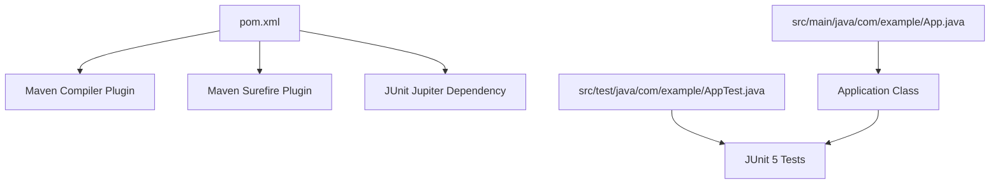
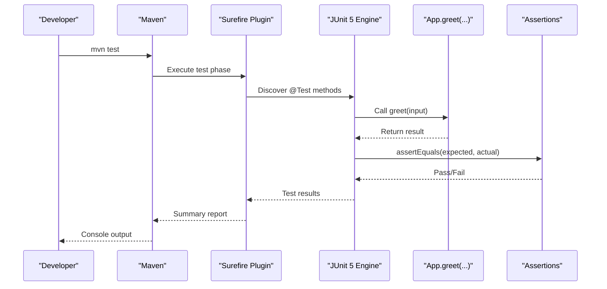
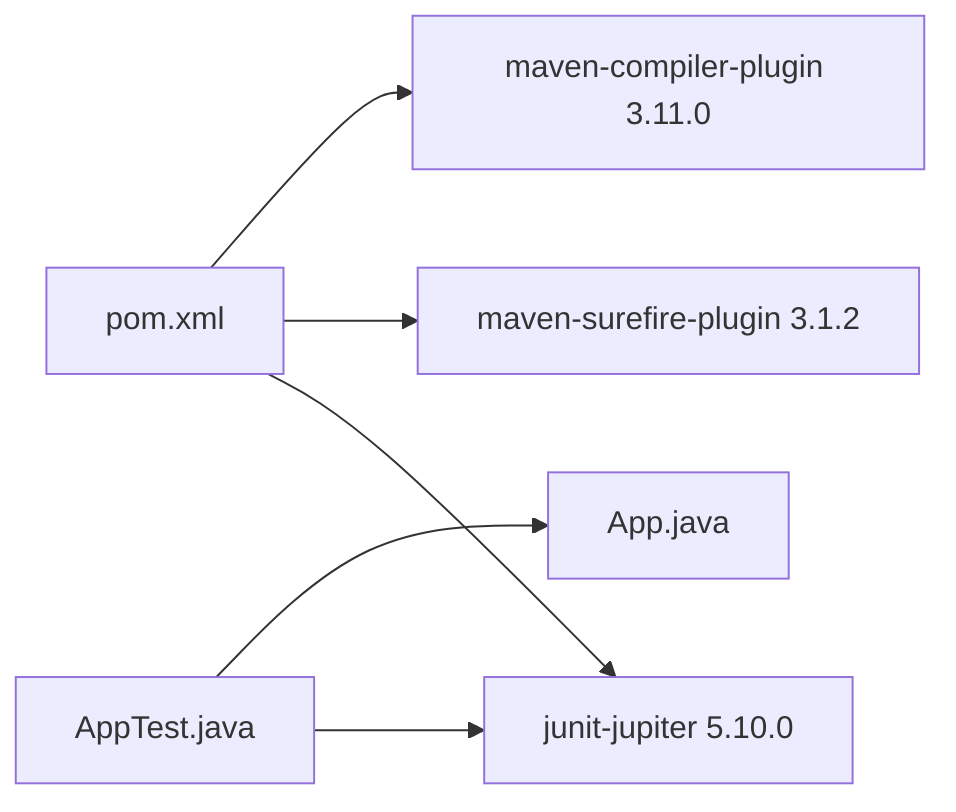

# Testing Framework

<cite>
**Referenced Files in This Document**
- [pom.xml](file://pom.xml)
- [App.java](file://src/main/java/com/example/App.java)
- [AppTest.java](file://src/test/java/com/example/AppTest.java)
- [.gitignore](file://.gitignore)
</cite>

## Table of Contents
1. [Introduction](#introduction)
2. [Project Structure](#project-structure)
3. [Core Components](#core-components)
4. [Architecture Overview](#architecture-overview)
5. [Detailed Component Analysis](#detailed-component-analysis)
6. [Dependency Analysis](#dependency-analysis)
7. [Performance Considerations](#performance-considerations)
8. [Troubleshooting Guide](#troubleshooting-guide)
9. [Conclusion](#conclusion)
10. [Appendices](#appendices)

## Introduction
This document explains the unit testing implementation for the Test AI Project using JUnit 5 and Maven Surefire. It covers how tests are configured, how to run them, the structure and patterns used in the test class, and best practices for maintaining high-quality tests as the application grows.

## Project Structure
The project follows a standard Maven layout:
- Application code under src/main/java
- Tests under src/test/java
- Build configuration in pom.xml

**Diagram sources**
- [pom.xml:21-46](file://pom.xml#L21-L46)
- [App.java:1-17](file://src/main/java/com/example/App.java#L1-L17)
- [AppTest.java:1-18](file://src/test/java/com/example/AppTest.java#L1-L18)

**Section sources**
- [pom.xml:1-49](file://pom.xml#L1-L49)
- [App.java:1-17](file://src/main/java/com/example/App.java#L1-L17)
- [AppTest.java:1-18](file://src/test/java/com/example/AppTest.java#L1-L18)

## Core Components
- JUnit 5 (Jupiter) is integrated via the junit-jupiter dependency with test scope.
- Maven Surefire Plugin executes JUnit 5 tests during the test lifecycle phase.
- The application exposes a simple static method that returns a greeting string based on input.
- The test class validates expected outputs for normal and edge cases using assertions.

Key responsibilities:
- pom.xml configures Java version, dependencies, and plugins for compilation and test execution.
- App.java provides the greet method to be tested.
- AppTest.java contains JUnit 5 tests that assert correct behavior.

**Section sources**
- [pom.xml:15-46](file://pom.xml#L15-L46)
- [App.java:13-15](file://src/main/java/com/example/App.java#L13-L15)
- [AppTest.java:6-17](file://src/test/java/com/example/AppTest.java#L6-L17)

## Architecture Overview
The testing architecture centers around JUnit 5 and Maven Surefire:
- Maven compiles both main and test sources.
- Surefire discovers and runs @Test methods in classes under src/test/java.
- Tests call into production code and validate results with assertions.

**Diagram sources**
- [pom.xml:21-46](file://pom.xml#L21-L46)
- [AppTest.java:8-16](file://src/test/java/com/example/AppTest.java#L8-L16)
- [App.java:13-15](file://src/main/java/com/example/App.java#L13-L15)

## Detailed Component Analysis

### JUnit 5 Integration in pom.xml
- JUnit Jupiter dependency is declared with test scope, ensuring it is available only for compiling and running tests.
- Maven Compiler Plugin sets Java source/target to 17.
- Maven Surefire Plugin (versioned) runs JUnit 5 tests automatically when executing mvn test.

How to run tests with Maven:
- Run all tests: mvn test
- Compile without running tests: mvn compile
- Skip tests: mvn package -DskipTests
- Run a specific test class: mvn test -Dtest=AppTest
- Run a specific test method: mvn test -Dtest=AppTest#greetShouldReturnPersonalizedMessage

Notes:
- Ensure Java 17 is installed and JAVA_HOME points to a JDK 17 distribution.
- If you use an IDE, configure it to use the same Java version to avoid mismatch errors.

**Section sources**
- [pom.xml:15-46](file://pom.xml#L15-L46)

### AppTest.java: Structure and Patterns
The test class demonstrates:
- JUnit 5 annotations (@Test)
- Static imports for assertions
- Two test methods covering:
  - Normal case: verifying a personalized greeting
  - Edge case: handling an empty name

Testing patterns used:
- Arrange-Act-Assert style within each test method
- Direct assertion of return values using assertEquals
- Clear, descriptive test method names indicating expected behavior

Examples of adding new test cases following existing patterns:
- Add a new @Test method that calls App.greet with different inputs and asserts the expected output.
- Keep method names descriptive, e.g., greetShouldHandleNullName or greetShouldTrimWhitespace.
- Place new tests in the same class to maintain cohesion; consider splitting into multiple classes if the number of tests grows significantly.

Note on parameterized testing:
- While this project currently uses individual @Test methods, JUnit 5 supports parameterized tests via @ParameterizedTest and @CsvSource. You can adopt this pattern when you need to test many input/output pairs concisely.

**Section sources**
- [AppTest.java:1-18](file://src/test/java/com/example/AppTest.java#L1-L18)

### App.java: Target Under Test
- Provides a simple static method that constructs a greeting string from its argument.
- The main method handles command-line usage but is not directly covered by unit tests here.

Testing considerations:
- Focus tests on the pure function greet(String), which has deterministic output.
- For CLI behavior, consider integration tests or separate test utilities if needed.

**Section sources**
- [App.java:1-17](file://src/main/java/com/example/App.java#L1-L17)

## Dependency Analysis
The build and test pipeline depends on:
- JUnit Jupiter for writing and running tests
- Maven Surefire for discovering and executing tests
- Java 17 compiler settings

**Diagram sources**
- [pom.xml:21-46](file://pom.xml#L21-L46)
- [AppTest.java:1-18](file://src/test/java/com/example/AppTest.java#L1-L18)
- [App.java:1-17](file://src/main/java/com/example/App.java#L1-L17)

**Section sources**
- [pom.xml:21-46](file://pom.xml#L21-L46)

## Performance Considerations
- Keep tests fast and focused on single behaviors.
- Avoid heavy I/O or network calls in unit tests; mock external dependencies if necessary.
- Use minimal setup per test; prefer lightweight fixtures.
- Group related tests logically to improve discoverability and parallel execution potential.

[No sources needed since this section provides general guidance]

## Troubleshooting Guide
Common issues and resolutions:
- Java version mismatch: Ensure JAVA_HOME and your IDE use Java 17 as configured in pom.xml.
- Tests not discovered: Verify test classes are under src/test/java and annotated with @Test.
- Assertion failures: Check expected vs actual values and ensure inputs match intended scenarios.
- Slow builds: Run a single test class or method to isolate issues.

Interpreting test execution output:
- Successful run shows a summary with passed tests and duration.
- Failed tests include stack traces pointing to the failing assertion line.
- Use the reported file and line numbers to locate and fix issues.

Debugging failing tests:
- Run the specific test in debug mode from your IDE.
- Inspect variables and step through the test logic.
- Temporarily print or log intermediate values if needed.

**Section sources**
- [pom.xml:15-46](file://pom.xml#L15-L46)
- [AppTest.java:8-16](file://src/test/java/com/example/AppTest.java#L8-L16)

## Conclusion
The project uses a clean, minimal setup with JUnit 5 and Maven Surefire to validate core functionality. The existing tests cover typical and edge-case inputs for the greeting method. By following the established patterns and adopting best practices such as clear naming, focused assertions, and optional parameterized tests, you can scale the test suite effectively as the application evolves.

[No sources needed since this section summarizes without analyzing specific files]

## Appendices

### How to Run Tests with Maven
- Run all tests: mvn test
- Compile only: mvn compile
- Package skipping tests: mvn package -DskipTests
- Run a specific test class: mvn test -Dtest=AppTest
- Run a specific test method: mvn test -Dtest=AppTest#greetShouldReturnPersonalizedMessage

**Section sources**
- [pom.xml:21-46](file://pom.xml#L21-L46)

### Test Coverage Expectations and Best Practices
- Aim for meaningful coverage of public APIs and critical paths rather than chasing arbitrary percentages.
- Prefer tests that verify behavior over those that merely increase coverage metrics.
- Maintain readability and clarity; refactor tests alongside production code.
- Introduce parameterized tests for repetitive input/output scenarios.
- Regularly review and prune obsolete tests to keep the suite maintainable.

[No sources needed since this section provides general guidance]